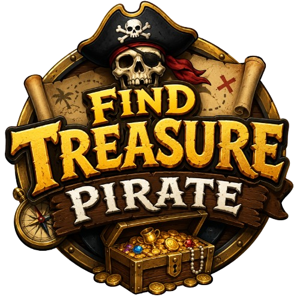
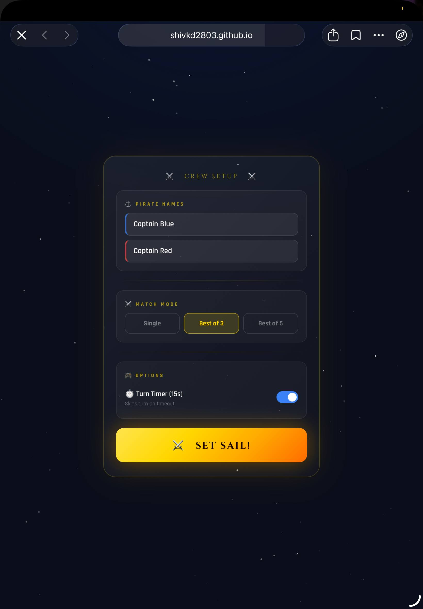

# 🏴‍☠️ Find Treasure Pirate

A cinematic two-player pirate treasure hunting game built with **HTML, CSS, and JavaScript** featuring animated gameplay, responsive UI, sound effects, splash screens, and competitive multiplayer mechanics.



---

# ✨ Features

- ⚓ Beautiful Pirate Themed UI
- 🏆 Two Player Gameplay
- 🎯 Random Treasure Generation
- 🔥 Win Streak System
- ⏱ Optional Turn Timer
- 🎵 Built-in Sound Effects
- 🌌 Animated Background & Particles
- 📱 Fully Responsive (Phone / Tablet / Desktop)
- 🗺️ Interactive Tile Board
- 🎉 Winner Celebration Modal
- 💀 Taunt Opponent System
- 🏴‍☠️ Splash Screen + Crew Setup

---
# 📸 Screenshots

<div align="center">

<table>
<tr>
<td align="center">

<br/>
<b>Splash Screen</b>
</td>

<td align="center">

<br/>
<b>Crew Setup</b>
</td>
</tr>

<tr>
<td align="center">

<br/>
<b>Main Gameplay</b>
</td>

<td align="center">

<br/>
<b>Winner Modal</b>
</td>
</tr>

<tr>
<td align="center" colspan="2">

<br/>
<b>Final Preview</b>
</td>
</tr>
</table>

</div>
# 📸 Screenshots

## Splash Screen

)

---

## Crew Setup Screen


---

## Main Gameplay


---

## Winner Modal


---

# 🚀 Live Demo

Add your deployed link here:

```txt
https://your-game-link.com
```

---

# 🛠️ Tech Stack

| Technology | Usage |
|------------|------|
| HTML5 | Structure |
| CSS3 | Styling & Animations |
| JavaScript | Game Logic |
| Web Audio API | Sound Effects |

---

# 📂 Project Structure

```bash
Find-Treasure-Pirate/
│
├── index.html
├── style.css
├── script.js
├── logo.png
│
├── screenshots/
│   ├── banner.png
│   ├── splash-screen.png
│   ├── setup-screen.png
│   ├── gameplay.png
│   └── winner-modal.png
│
└── README.md
```

---

# 🎮 How To Play

1. Enter both pirate names.
2. Select match mode:
   - Single
   - Best of 3
   - Best of 5
3. Start the game.
4. Players take turns opening tiles.
5. Empty tile = turn passes.
6. Treasure tile = point scored.
7. First player to win required rounds becomes the champion.

---

# ⚙️ Installation

## Clone Repository

```bash
git clone https://github.com/yourusername/find-treasure-pirate.git
```

---

## Open Project

Simply open:

```bash
index.html
```

inside your browser.

---

# 📱 Responsive Design

The game is optimized for:

- 📱 Mobile Phones
- 📲 Tablets / iPads
- 💻 Desktop Screens

---

# 🔊 Audio System

Includes custom generated sound effects for:

- Tile Reveal
- Treasure Discovery
- Turn Switch
- Danger Mode
- Win Streaks
- Timeout Warning

---

# 🌟 Future Improvements

- 🌐 Online Multiplayer
- 🤖 AI Opponent
- 🎨 Theme Customization
- 🏅 Leaderboard System
- 💬 Live Chat
- 🎵 Background Pirate Music

---

# 🤝 Contributing

Pull requests are welcome.

For major changes, please open an issue first to discuss what you'd like to change.

---

# 📜 License

This project is licensed under the MIT License.

---

# 👨‍💻 Developer

Created with ❤️ by **Your Name**

GitHub:  
```txt
https://github.com/yourusername
```

---

# ⭐ Support

If you liked this project:

- ⭐ Star this repository
- 🍴 Fork the project
- 🏴‍☠️ Share with friends

---

# 🏆 Final Preview


